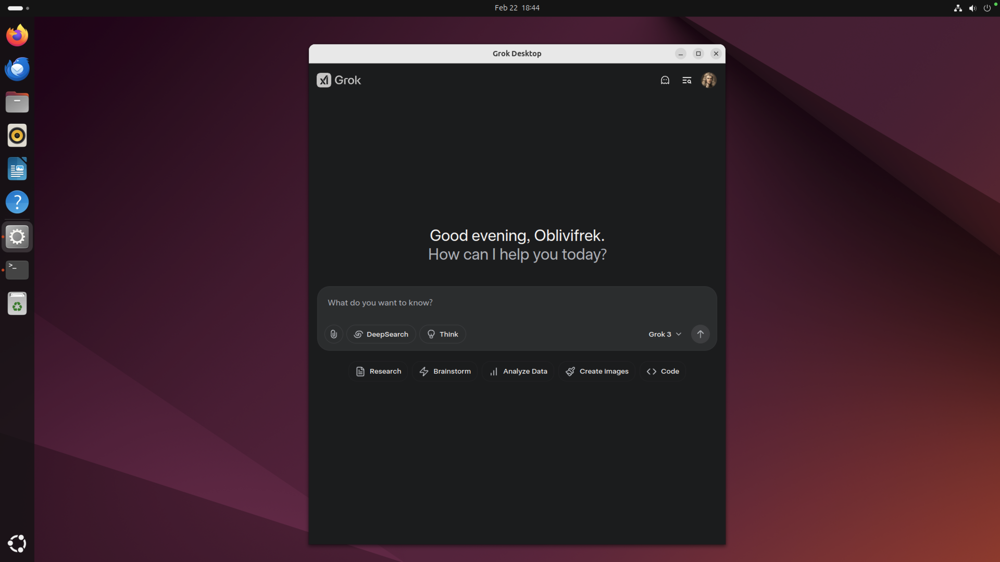

# Grok Desktop Wrapper Application for Windows, macOS and Linux (x86 / ARM)


The Grok Desktop Application Wrapper is a versatile tool designed to run on all platforms and architectures. It allows you to use Grok without the need to open a web browser, as it encapsulates the application in its own dedicated wrapper, effectively turning it into a standalone app.

```CommandOrControl+Shift+L``` Keyboard Shortcut to Logout

## Installation
https://github.com/Ash-Bash/Grok-Desktop-Wrapper/releases 

## Development
### Setup
```
npm install
```

### Run Application (Dev-Env)
```
npm run start
```
or
```
npm start
```

### Build Application
```
npm build
```
or
```
npm run build
```

### if Electron-Builder fails (install as a Global Package)
```
npm install -g electron-builder
```

Bineries get built in the ```./dist``` Directory

### Requirements
* NodeJS ``` ~v22.12.0 LTS```
* ElectronJS ``` ~v40.1.0 ```


## Todos
* Ability to Sign-out - Partically Done (using ```CommandOrControl+Shift+L``` Keyboard Shortcut to Logout)
* Buildchain needs more work

## Screenshots

### Windows


### macOS


### Linux
